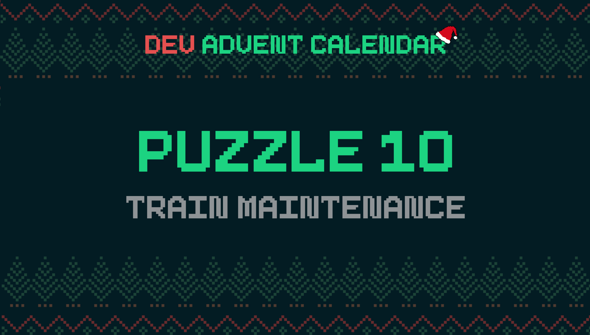

ℹ️ For detailed information about the contest, check out [devadvent/readme](https://github.com/devadvent/readme/)

# Dev Advent Calendar 🎅 Puzzle 10 - Train maintenance 🚂

Winters at the North Pole can be harsh, which not only affects the elves, but also technology.
Some of the train wagons that are used to transport materials, presents, etc. in and out of the North Pole are really old.
In this hash weather, fauly breaks can cause accidents on the tracks.

That is why you help the head mechanic elf to check today's train wagons if they're up to code or not.

> Today's puzzle is a bit more complicated. But I can give you a hint to the prize 🏆:
>
> You need a special kind of wallet to receive it 👀

## 🧩 The puzzle

_The concept that is being threated today is called a [Singly Linked List](https://www.freecodecamp.org/news/data-structures-explained-with-examples-linked-list). If this is new to you, you might get through this puzzle faster if you read up on it._

The train is composed of:

-   Locomotive which has attached to a wagon
-   Multiple wagons which each ahve maximum 1 wagon attached to it

The next wagon that is attached to either the locomotive or another wagon, is called `next`. When that value is `null`, that means it's the last wagon on the train

```
  +-----+--+         +-----+--+          +-----+--+        +-----+------+
  |  L  |next --->   | W-1 |next --->    | W-2 |next --->  | W-3 | null |
  +-----+--+         +-----+--+          +-----+--+        +-----+------+

```

The box named `L` is the locomotive, and `W-1` - `W-3` are the wagons.
In order to check all the wagons, you need to start at the locomotive!
You can find the complete train in [src/data/train.js](src/data/train.js).

💡 Hint: Check out the [src/index.js](src/index.js) file to see how the functions going to be used.

It is your job to complete two functions in the [src/utils/train.js](src/utils/train.js):

-   [iterateWagons](#iteratewagons)
-   [filterOldBreaks](#filteroldbreaks)

### iterateWagons

"Walk" through the entire train, when given a starting point (the locomotive).
There are three parameters:

-   `start`: Starting point of the chain. Ideally the locomotive.
-   `actionFn`: A function that is executed for every filtered item. Use the predefined `defaultFilterFn` as default
-   `filterFn`: Function that filters the list, following the principles of [Array filter methods](https://developer.mozilla.org/en-US/docs/Web/JavaScript/Reference/Global_Objects/Array/filter). Use the predefined `defaultActionFn` as default

### filterOldBreaks

Check if the `lastBreakRevision` is older than 1 year, compared to today's date.
Return `true` when the break revision is older than 1 year!

ℹ️ This is a function that can be passed as `filterFn` in `iterateWagons`.

## 🚢 Ship your solution

Check out the [contributing guide](https://github.com/devadvent/readme/blob/main/CONTRIBUTING.md) for details about how to participate.

In short:

-   ✨ Create your repository by [acceping the assignment](https://classroom.github.com/a/4Bq3WTvV) using the participation link
-   🧩 Solve the puzzle
-   🐦 Add your Twitter handle to `twitter.js`
-   🤖 Test your solution
-   🚀 Upload your changes to the `main` branch

## 🔗 Participation link

In order to participate, you need to enter the following link and accept the assignment:
[https://classroom.github.com/a/4Bq3WTvV](https://classroom.github.com/a/4Bq3WTvV)

## 💻 Use this project

### ⏳ Install the dependencies

Install the dependencies with

```bash
yarn install
```

or

```bash
npm install
```

### ⚙️ Run the code

Run the code with

```bash
yarn dev
```

or

```bash
npm run dev
```

### 🤖 Test your solution

This puzzle is equipped with automated tests (in the `./tests` folder). In order for your solution to qualify for winning the daily prize, **all** tests need to pass.

To run these tests, execute one of the following commands in your console:

```bash
yarn test
```

or

```bash
npm test
```
