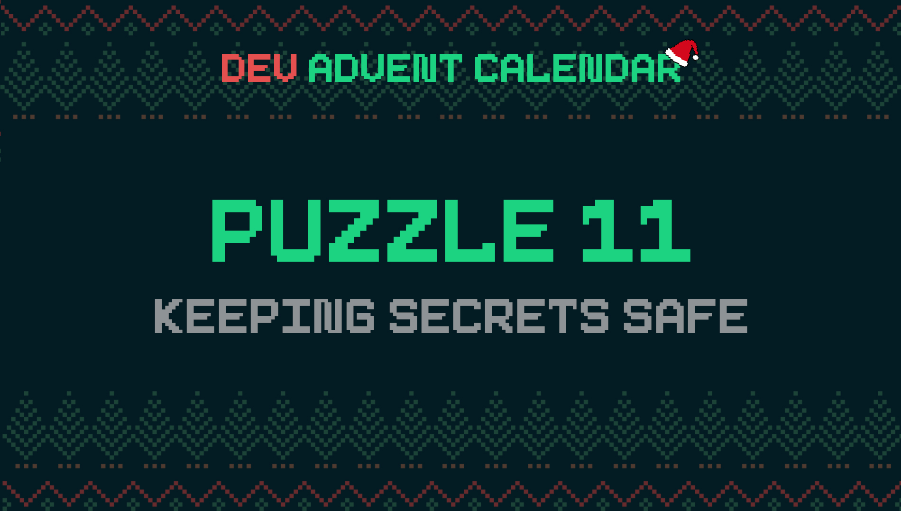

ℹ️ For detailed information about the contest, check out [devadvent/readme](https://github.com/devadvent/readme/)

# Dev Advent Calendar 🎅 Puzzle 11 - Keeping Secrets Safe 🔑

Some sections of the North Pole have restricted access, because they contain secrets, like Mrs. Claus's Hot Chocolate Recipe, codes to deactivate the invisibility shield around the village/factory, etc.

These passwords are being changed regularly, and the person that changes it (head elf) just keeps it in his mind. However, it has been noticed that he keeps reusing old passwords.
That's why the board has decided that passwords should be auto-generated.

It is your job to create a password generator for the North Pole operations.

## 🧩 The puzzle

Complete the function `generatePassword` in [src/utils/security.js](src/utils/security.js).

The input parameters are:

-   `length`: Desired length of the password as Number
-   `options`: Password options as object

Return the password as string with the **exact** desired length and at least one of each options. (See below what the options are)

### Password options

Password options is an _object_, where the desired options can be passed as `true`.
There are 4 possible options:

-   `lowercase`: Lowercase letters (a-z)
-   `uppercase`: Uppercase letters (A-Z)
-   `numbers`: Numbers (0-9)
-   `specialCharacters`: Special characters (only `!@#$%^&*()`)

Example:

```
{
  lowercase: true,
  numbers: true
}
```

or

```
{
  uppercase: true
  lowercase: true,
  specialCharacters: true
}
```

### Rules

-   Return the **exact** length of the desired password
-   Passwords should be random (two generated passwords should not be the same)
-   The password should contain **at least** one character for each option
-   When no options are passed, throw a `Error('NOT_ENOUGH_OPTIONS')`
-   When the length of the password is less than the number of options passedf, throw a `Error('PASSWORD_TOO_SHORT')`

## 🚢 Ship your solution

Check out the [contributing guide](https://github.com/devadvent/readme/blob/main/CONTRIBUTING.md) for details about how to participate.

In short:

-   ✨ Create your repository by [acceping the assignment](https://classroom.github.com/a/Art5BMTs) using the participation link
-   🧩 Solve the puzzle
-   🐦 Add your Twitter handle to `twitter.js`
-   🤖 Test your solution
-   🚀 Upload your changes to the `main` branch

## 🔗 Participation link

In order to participate, you need to enter the following link and accept the assignment:
[https://classroom.github.com/a/Art5BMTs](https://classroom.github.com/a/Art5BMTs)

## 💻 Use this project

### ⏳ Install the dependencies

Install the dependencies with

```bash
yarn install
```

or

```bash
npm install
```

### ⚙️ Run the code

Run the code with

```bash
yarn dev
```

or

```bash
npm run dev
```

### 🤖 Test your solution

This puzzle is equipped with automated tests (in the `./tests` folder). In order for your solution to qualify for winning the daily prize, **all** tests need to pass.

To run these tests, execute one of the following commands in your console:

```bash
yarn test
```

or

```bash
npm test
```
