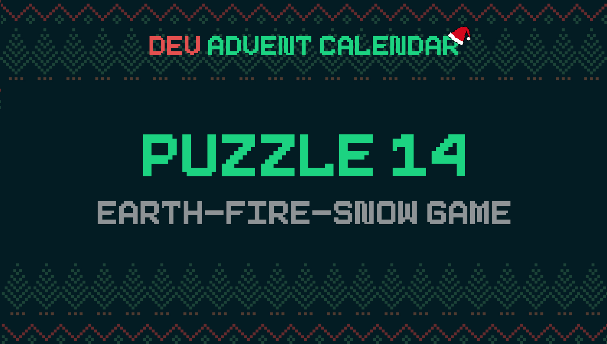

ℹ️ For detailed information about the contest, check out [devadvent/readme](https://github.com/devadvent/readme/)

# Dev Advent Calendar 🎅 Puzzle 14 - Earth-Fire-Snow Game 🌍🔥❄️

When two elves have to decide who has to do a chore, sometimes they use an ancient game to determine which player will be free of work.

The game is called Earth-Fire-Snow, and it works like this:
The two players choose either one of _snow_, _earth_, or _fire_. Then, at the same time they announce their choice.
The combination of the two defines who wins:

-   Fire _melts_ snow
-   Snow _covers_ earth
-   Earth _extinguishes_ fire

If both players select the same choice, it is a draw.

Your task is it to create a digital version for this, when it comes up when the elves do some work from home.

## 🧩 The puzzle

Complete the function `selectWinner` in [src/utils/deciding.js](src/utils/deciding.js).

As input the function expects two parameters: `user1` and `user2`. They are objects with the following properties:

-   `name`: Name of the participant
-   `choice`: Choice of the sign. Either of: `snow`, `earth`, `fire`

The function should return the user-object of the winner. For example:

```javascript
{ name: 'Santa', choice: 'fire' }
```

When it is a draw, the return value should be `null`

## 🚢 Ship your solution

Check out the [contributing guide](https://github.com/devadvent/readme/blob/main/CONTRIBUTING.md) for details about how to participate.

In short:

-   ✨ Create your repository by [acceping the assignment](https://classroom.github.com/a/kKqJwWCp) using the participation link
-   🧩 Solve the puzzle
-   🐦 Add your Twitter handle to `twitter.js`
-   🤖 Test your solution
-   🚀 Upload your changes to the `main` branch

## 🔗 Participation link

In order to participate, you need to enter the following link and accept the assignment:
[https://classroom.github.com/a/kKqJwWCp](https://classroom.github.com/a/kKqJwWCp)

## 💻 Use this project

### ⏳ Install the dependencies

Install the dependencies with

```bash
yarn install
```

or

```bash
npm install
```

### ⚙️ Run the code

Run the code with

```bash
yarn dev
```

or

```bash
npm run dev
```

### 🤖 Test your solution

This puzzle is equipped with automated tests (in the `./tests` folder). In order for your solution to qualify for winning the daily prize, **all** tests need to pass.

To run these tests, execute one of the following commands in your console:

```bash
yarn test
```

or

```bash
npm test
```
