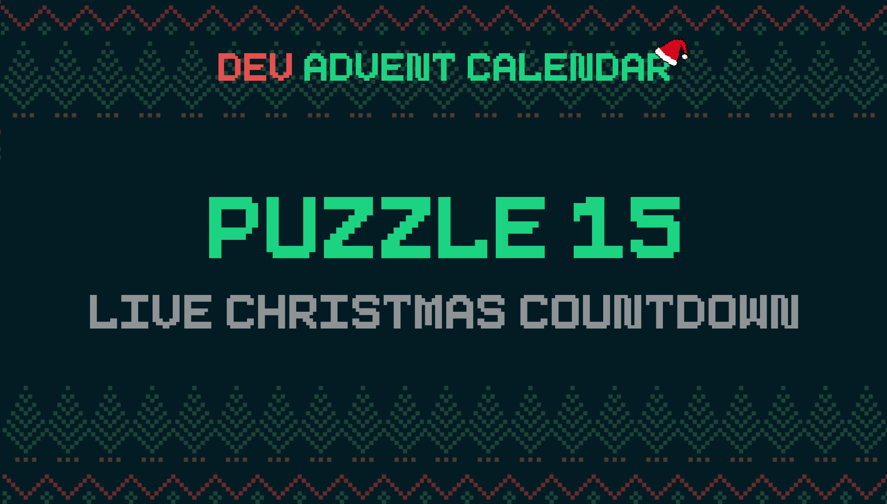

ℹ️ For detailed information about the contest, check out [devadvent/readme](https://github.com/devadvent/readme/)

# Dev Advent Calendar 🎅 Puzzle 15 - Live Christmas Countdown 🕒

Elves are extremely looking forward to Christmas. So the closer December 25th gets, the more excited they are.
Therefore Santa decided to make a big display of how much time left until Christmas, **in real-time**.

You are in charge to create this display.

## 🧩 The puzzle

The app skeleton is already created for you (in [Vue.js](https://vuejs.org)).

You need to complete the function `countdown` and `formatCountdown` in [src/utils/date-format.js](src/utils/date-format.js).

### `countdown`

Takes two parameters:

-   `date`: Date for when the countdown clock should be to zero
-   `referenceDate`: Date from which should be counted (usually the current time stamp)

Return how many days, hours, minutes, and seconds are left on the countdown, in the form of an object:

```javascript
{
    days: 9,
    hours: 5,
    minutes: 50,
    seconds: 7
}
```

Each value in this object should be of type `Number`.

### `formatCountdown`

Takes one parameter:

-   `countdown`: The result of `countdown`-function from above

Return a human readable text of how many days are left, for example:

```
9 days, 5 hours, 40 minutes, 56 seconds
```

**The rules for this function:**

-   The format should be exactly as show: X days, X hours, X minutes, X seconds. Exactly with comma and space
-   When a value is 0, don't display it BUT ONLY if it's a leading value. Meaning:
    -   0 days, _5 hours, 40 minutes, 56 seconds_ is wrong ❌ (should be: _5 hours, 40 minutes, 56 seconds_)
    -   _5 hours, 40 minutes, 56 seconds_ is correct ✅
    -   _5 hours, 0 minutes, 56 seconds_ is correct ✅
    -   _5 hours, 34 minutes, 0 seconds_ is correct ✅
    -   _5 hours, 0 minutes, 0 seconds_ is correct ✅
-   When the event time is already over (all values `0`), it should return `No more wait`

## 🚢 Ship your solution

Check out the [contributing guide](https://github.com/devadvent/readme/blob/main/CONTRIBUTING.md) for details about how to participate.

In short:

-   ✨ Create your repository by [acceping the assignment](https://classroom.github.com/a/gbsUXaaJ) using the participation link
-   🧩 Solve the puzzle
-   🐦 Add your Twitter handle to `twitter.js`
-   🤖 Test your solution
-   🚀 Upload your changes to the `main` branch

## 🔗 Participation link

In order to participate, you need to enter the following link and accept the assignment:
[https://classroom.github.com/a/gbsUXaaJ](https://classroom.github.com/a/gbsUXaaJ)

## 💻 Use this project

### ⏳ Install the dependencies

Install the dependencies with

```bash
yarn install
```

or

```bash
npm install
```

### ⚙️ Run the code

Run the code with

```bash
yarn dev
```

or

```bash
npm run dev
```

Watch the site on [http://localhost:3000](http://localhost:3000).

### 🤖 Test your solution

This puzzle is equipped with automated tests (in the `./tests` folder). In order for your solution to qualify for winning the daily prize, **all** tests need to pass.

To run these tests, execute one of the following commands in your console:

```bash
yarn test
```

or

```bash
npm test
```
