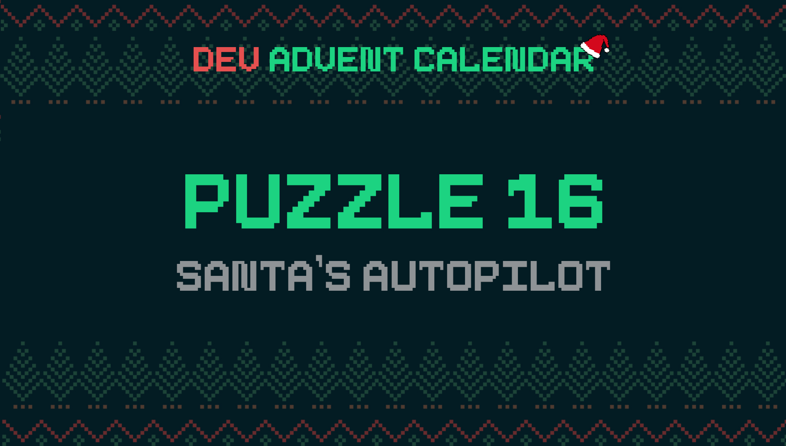

ℹ️ For detailed information about the contest, check out [devadvent/readme](https://github.com/devadvent/readme/)

# Dev Advent Calendar 🎅 Puzzle 16 - Santa's Autopilot 🤖🛷

To get home to the North Pole after his big night, Santa uses star constellations.
But after a whole night of delivering presents to children all around the world, he is tired, so that doing the navigation is a hassle.

Since on his way home, his sleigh flies at an altitude where it is not interfering with planes, drones, satellites, or other objects, it is safe to automate this.

Help the elves develop an autopilot for Santa's Sleigh.

## 🧩 The puzzle

### What already exists

The elves have already done some great work. They developed a 2D-map which displays the position of Sants's Sleigh (marked with `S`) and the North Pole (marked with `N`). Empty space is represented with `#`.
You can find some test data in [src/data](src/data).

Here is an example of a small map:

```
 ###N######
 ##########
 #######S##
 ##########
```

The function `generateMap` in [src/utils/map.js] creates a two-dimensional array, which maps it as follows:

-   The bottom of the map is `0`
-   The left of the map is `0`

```
 0 |  ###N######
 1 |  ##########
 2 |  #######S##
 3 |  ##########
   -------------
      0123456789
```

### Your tasks

You need to complete two functions in [src/utils/autopilot.js](src/utils/autopilot.js): `findDirection` and `navigateMap`.

**1. `findDirection`**

Find the direction in which the sleigh has to go in order to arrive at the North Pole the fastest.

This function accepts a single input parameter `map`, generated by `generateMap` (see above!).
The return value should be an array that describes the direction:

-   `['up']`
-   `['down']`
-   `['left']`
-   `['right']`
-   `['up', 'right']`
-   `['up', 'left']`
-   `['down', 'right']`
-   `['down', 'left']`

If there is no direction to go to (possibly arrived at the destination), return `null`

These should be the indications into which direction on the map the sleigh has to fly towards.

**2. `navigateMap`**

Update the map to the new position.

This function accepts two parameters:

-   `map`, generated by `generateMap` (see above!)
-   `direction`, the direction the sleigh needs to go (calculated by `generateMap`)

💡 Hint: The matrix is be vertically inverted, due to the fashion that `generateMap` outputs the map.

-   Remove Santa's symbol from the current position
-   Place Santa's symbol to the updated position

## 🚢 Ship your solution

Check out the [contributing guide](https://github.com/devadvent/readme/blob/main/CONTRIBUTING.md) for details about how to participate.

In short:

-   ✨ Create your repository by [acceping the assignment](https://classroom.github.com/a/cFfDkzup) using the participation link
-   🧩 Solve the puzzle
-   🐦 Add your Twitter handle to `twitter.js`
-   🤖 Test your solution
-   🚀 Upload your changes to the `main` branch

## 🔗 Participation link

In order to participate, you need to enter the following link and accept the assignment:
[https://classroom.github.com/a/cFfDkzup](https://classroom.github.com/a/cFfDkzup)

## 💻 Use this project

### ⏳ Install the dependencies

Install the dependencies with

```bash
yarn install
```

or

```bash
npm install
```

### ⚙️ Run the code

Run the code with

```bash
yarn dev
```

or

```bash
npm run dev
```

ℹ️ In the [src/index.js](src/index.js) file, the autopilot is simulated with a 500ms delay. This way you can see live what your algorithm does.

ℹ️ There are 4 demo-maps to test out your code in [src/data](src/data). You can switch out the file name in the `index.js` file.

### 🤖 Test your solution

This puzzle is equipped with automated tests (in the `./tests` folder). In order for your solution to qualify for winning the daily prize, **all** tests need to pass.

To run these tests, execute one of the following commands in your console:

```bash
yarn test
```

or

```bash
npm test
```
