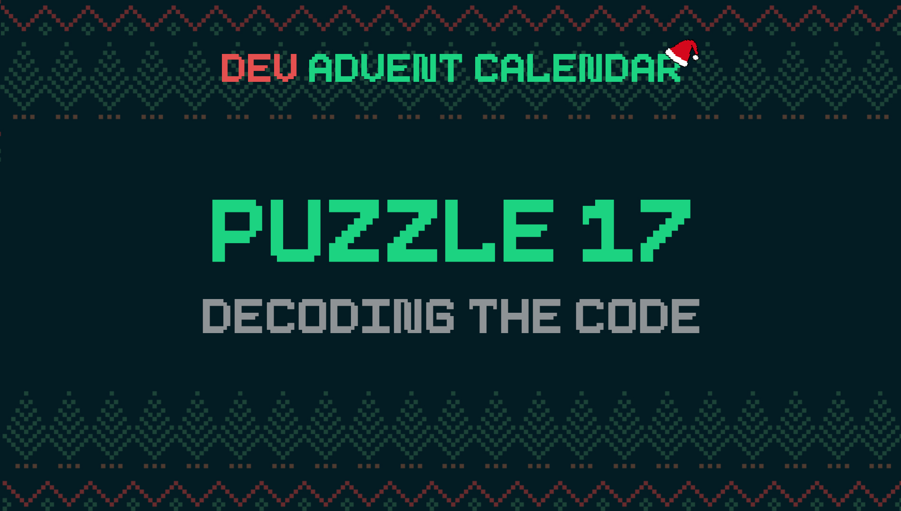

ℹ️ For detailed information about the contest, check out [devadvent/readme](https://github.com/devadvent/readme/)

# Dev Advent Calendar 🎅 Puzzle 17 - Decoding The Code 🔐

While the head elf was replacing all existing password with the number generator made in [puzzle 11](https://github.com/devadvent/puzzle-11), he came upon one specific case where he actually forgot the password.
It is a very old password, when security was not an issue, and we have access to the database to extract the _hashcode_ from the password.

It is your job to extract the password from the given hash code.

## 🧩 The puzzle

### What already exists

This is the hash we found in the database: `070ccd1dc4f6b82b1efe79bec3fe320447289f00`

[Hashes](https://en.wikipedia.org/wiki/Cryptographic_hash_function) are strings that can be generated in one way, but supposed to not be "_decodedable_" the other way around.

There probably are ways to do this cleverly, but we don't have a lot of time, and thankfully the head elf remembers what the password policy looked like back when he created it.
So we can _bruteforce_ the password (try all possible variations until we find the correct one).

The password policy back in the day was: `<UPPER CASE LETTER>-<3-DIGIT-NUMBER>`
For example: `X-348`, `L-239`, `V-111`.

Your task is it to complete the function `bruteForcePassword` in [src/utils/password.js](src/utils/password.js).
It accepts one parameter:

-   `hash`: The given hash that is found in the database (e.g. `070ccd1dc4f6b82b1efe79bec3fe320447289f00`)

The function should return the original password as string.
If the password could not be decoded, return `null`.

This function should all work with all passwords using the above-mentioned password policy.

### Hints 💡

-   It appears that the hash is a _SHA-1_ hash
-   Node.js seems to have a [crypto module](https://nodejs.org/api/crypto.html) that seems interesting for solving this task

## 🚢 Ship your solution

Check out the [contributing guide](https://github.com/devadvent/readme/blob/main/CONTRIBUTING.md) for details about how to participate.

In short:

-   ✨ Create your repository by [acceping the assignment](https://classroom.github.com/a/_UNcH8zQ) using the participation link
-   🧩 Solve the puzzle
-   🐦 Add your Twitter handle to `twitter.js`
-   🤖 Test your solution
-   🚀 Upload your changes to the `main` branch

## 🔗 Participation link

In order to participate, you need to enter the following link and accept the assignment:
[https://classroom.github.com/a/\_UNcH8zQ](https://classroom.github.com/a/_UNcH8zQ)

## 💻 Use this project

### ⏳ Install the dependencies

Install the dependencies with

```bash
yarn install
```

or

```bash
npm install
```

### ⚙️ Run the code

Run the code with

```bash
yarn dev
```

or

```bash
npm run dev
```

### 🤖 Test your solution

This puzzle is equipped with automated tests (in the `./tests` folder). In order for your solution to qualify for winning the daily prize, **all** tests need to pass.

To run these tests, execute one of the following commands in your console:

```bash
yarn test
```

or

```bash
npm test
```
