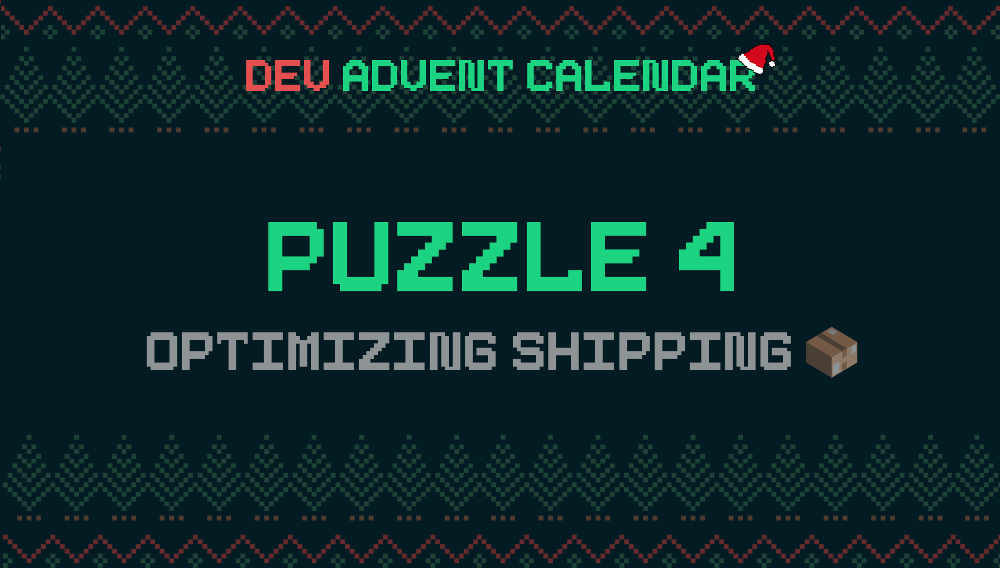

ℹ️ For detailed information about the contest, check out [devadvent/readme](https://github.com/devadvent/readme/)

# Dev Advent Calendar 🎅 Puzzle 4 - Optimizing shipping 📦

You might not know this, but the Elf Post Service 📯 (ECS) is the largest parcel organization in the world. (For obvious reasons though, now that you think about, right?). They are ecologically responsible, so they continuously try to make everything more efficient, also when sending out packages.

That's why they introduced some new box sizes, in order to waste less paper/carton. Before, there were only 3 sizes (S, M, L), now there is a selection of 7 different sizes. This makes it not always that obvious which package is right for which item.

**Santa himself asked for your help to develop an algorithm that can select the smallest possible box (but big enough for the item to fit) for any given item.**

## 🧩 The puzzle

You can find the list of available boxes in the file [src/data/boxes.js](src/data/boxes.js).

Your job is to complete the function `selectBox` from the file [src/utils/select.js](src/utils/select.js) and return the box object that is best for any given item.

An `item` needs to have a width, lenght and height. For example:

```javascript
{
    width: 32,
    length: 62,
    height: 20,
}
```

As you can see in [src/data/boxes.js](src/data/boxes.js), the boxes have the same properties.

Rules for the algorithm:

-   Select the smallest possible box
-   You can neglect padding inside the box
-   You can assume there is always only one item in the box
-   You can assume the array of boxes in `boxes.js` is ordered by size
-   When the item is too big for any of the available boxes, return `undefined`
-   All of this should work without changes, even if new boxes sizes are introduces

## 🚢 Ship your solution

Check out the [contributing guide](https://github.com/devadvent/readme/blob/main/CONTRIBUTING.md) for details about how to participate.

In short:

-   ✨ Create your repository by [acceping the assignment](https://classroom.github.com/a/8gTymnXm) using the participation link
-   🧩 Solve the puzzle
-   🐦 Add your Twitter handle to `twitter.js`
-   🤖 Test your solution
-   🚀 Upload your changes to the `main` branch

## 🔗 Participation link

In order to participate, you need to enter the following link and accept the assignment:
[https://classroom.github.com/a/8gTymnXm](https://classroom.github.com/a/8gTymnXm)

## 💻 Use this project

### ⏳ Install the dependencies

Install the dependencies with

```bash
yarn install
```

or

```bash
npm install
```

### ⚙️ Run the code

Run the code with

```bash
yarn dev
```

or

```bash
npm run dev
```

### 🤖 Test your solution

This puzzle is equipped with automated tests (in the `./tests` folder). In order for your solution to qualify for winning the daily prize, **all** tests need to pass.

To run these tests, execute one of the following commands in your console:

```bash
yarn test
```

or

```bash
npm test
```
