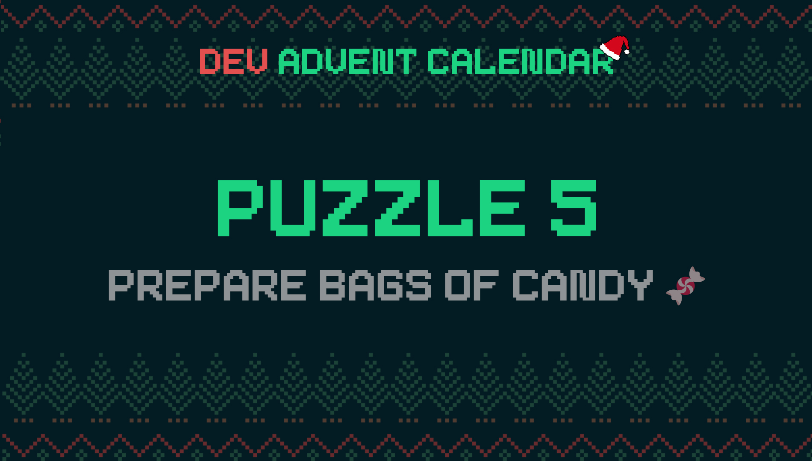

ℹ️ For detailed information about the contest, check out [devadvent/readme](https://github.com/devadvent/readme/)

# Dev Advent Calendar 🎅 Puzzle 5 - Prepare Bags of Candy 🍫🍬🍭

The elves are about to prepare bags of candy that they want to add to each present this year (you know, everyone had a hard year with Covid still being around and all).
Because Santa is a perfectionist, he wants no repeated candy in any of the bags.

**He asked you if you could write a program that creates bags of candy that has no repeated candy in it.**

## 🧩 The puzzle

You can find the list of available candies in the file [src/data/candies.js](src/data/candies.js).

Your job is to complete the function `generateCandyBags` from the file [src/utils/candy.js](src/utils/candy.js) and return an array of "candy bags".
Each bag has a unique ID - for the candy machine to create these bags, it's required that this is a UUID (💡 hint: [https://www.npmjs.com/package/uuid](https://www.npmjs.com/package/uuid)).
Furthermore, it needs a property of `candies`, which should be an array of which candy to put inside.

The function takes two parameters:

-   `bagCount`: How many bags should be generated
-   `candyCount`: How many candies each of the generated bags should have

Rules for the algorithm:

-   When no parameter is passed, return an empty array
-   When the `candyCount` parameter is not passed, default to 3
-   Each generated bag should have a valid UUID
-   No candy should be in the bag more than once
-   Not every bag should have the same candy (mix it up!)
-   If `candyCount` is higher than the amount of different types of candy available, throw an `Error('TOO_MUCH_CANDY_PER_BAG')`

### Example of a response

This is an example response of `generateCandyBags(5,2)`:

```javascript
;[
    {
        id: '43a0046f-a69b-4c61-b52e-b5a9873eac43',
        candies: ['Candy Canes', 'Pumpkin Spice Lollipops'],
    },
    {
        id: '10772c4c-2e57-4359-adce-734ae9f5c24c',
        candies: ['Dark Chocolate Covered Pretzels', 'Glazed Apples'],
    },
    {
        id: 'd3836f5e-dff9-4c5f-a289-41de935bd322',
        candies: ['Pumpkin Spice Lollipops', 'Salted Caramels'],
    },
    {
        id: '6a0c0ea9-a217-42f7-8943-a862a3487e84',
        candies: ['Pumpkin Spice Lollipops', 'Chocolate Christmas Trees'],
    },
    {
        id: 'b0a366e5-21c2-4bf8-8933-dd075e11bfc8',
        candies: ['Pumpkin Spice Lollipops', 'Dark Chocolate Covered Pretzels'],
    },
]
```

## 🚢 Ship your solution

Check out the [contributing guide](https://github.com/devadvent/readme/blob/main/CONTRIBUTING.md) for details about how to participate.

In short:

-   ✨ Create your repository by [acceping the assignment](https://classroom.github.com/a/7C7BRLrg) using the participation link
-   🧩 Solve the puzzle
-   🐦 Add your Twitter handle to `twitter.js`
-   🤖 Test your solution
-   🚀 Upload your changes to the `main` branch

## 🔗 Participation link

In order to participate, you need to enter the following link and accept the assignment:
[https://classroom.github.com/a/7C7BRLrg](https://classroom.github.com/a/7C7BRLrg)

## 💻 Use this project

### ⏳ Install the dependencies

Install the dependencies with

```bash
yarn install
```

or

```bash
npm install
```

### ⚙️ Run the code

Run the code with

```bash
yarn dev
```

or

```bash
npm run dev
```

### 🤖 Test your solution

This puzzle is equipped with automated tests (in the `./tests` folder). In order for your solution to qualify for winning the daily prize, **all** tests need to pass.

To run these tests, execute one of the following commands in your console:

```bash
yarn test
```

or

```bash
npm test
```
