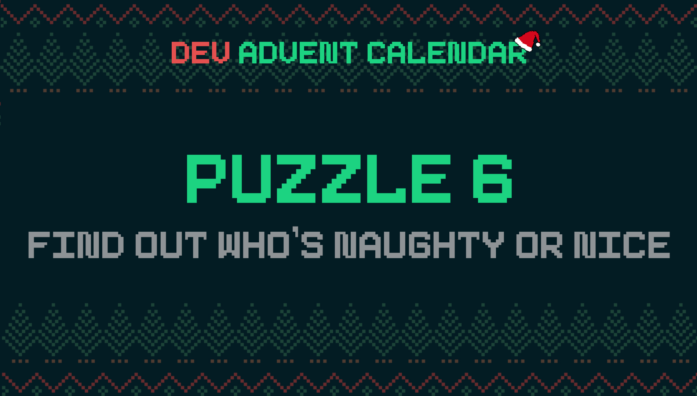

ℹ️ For detailed information about the contest, check out [devadvent/readme](https://github.com/devadvent/readme/)

# Dev Advent Calendar 🎅 Puzzle 6 - Making a list, checking it twice 📜

You might have heard from the song _Santa Claus is Coming to Town_ the lines:

> He's making a list. He's checking it twice. He's gonna find out who's naughty or nice

Well, that is exactly what your task is for today: Write a program that checks a list of kids and analyze whether they were naughty or nice, so that Santa knows if they deserve candy and toys, or coal...

## 🧩 The puzzle

You have sample data in [./src/data/sampleData.json](data/sampleData.json). It is an array with names of kids, and `events` that happened throughout the year.
This is an array of objects with `name` (description of the event) and `effect` (how it affects the naughty/nice score)."

Some of them are nice acts 😇, such as helping an elderly person cross the road. And some are naughty acts 😈, like stealing candy.

Your job is it to complete four function in the [utils/naughtyOrNice.js](./src/utils/naughtyOrNice.js):

-   `getKids`: Read the array of kids from the sample data and return it
-   `findOutIfNaughtyOrNice`: Analyze the `events` of a given `kid`, and calculate the total naughty/nice score using the `effect` properties from the events. Return `naughty` if the score is below `0`. Otherwise return `nice`.
-   `getNiceKids`: Return an array of only nice kids
-   `getNaughtyKids`: Return an array of only naughty kids

## 🚢 Ship your solution

Check out the [contributing guide](https://github.com/devadvent/readme/blob/main/CONTRIBUTING.md) for details about how to participate.

In short:

-   ✨ Create your repository by [acceping the assignment](https://classroom.github.com/a/_f3ohHCp) using the participation link
-   🧩 Solve the puzzle
-   🐦 Add your Twitter handle to `twitter.js`
-   🤖 Test your solution
-   🚀 Upload your changes to the `main` branch

## 🔗 Participation link

In order to participate, you need to enter the following link and accept the assignment:
[https://classroom.github.com/a/\_f3ohHCp](https://classroom.github.com/a/_f3ohHCp)

## 💻 Use this project

### ⏳ Install the dependencies

Install the dependencies with

```bash
yarn install
```

or

```bash
npm install
```

### ⚙️ Run the code

Run the code with

```bash
yarn dev
```

or

```bash
npm run dev
```

### 🤖 Test your solution

This puzzle is equipped with automated tests (in the `./tests` folder). In order for your solution to qualify for winning the daily prize, **all** tests need to pass.

To run these tests, execute one of the following commands in your console:

```bash
yarn test
```

or

```bash
npm test
```
