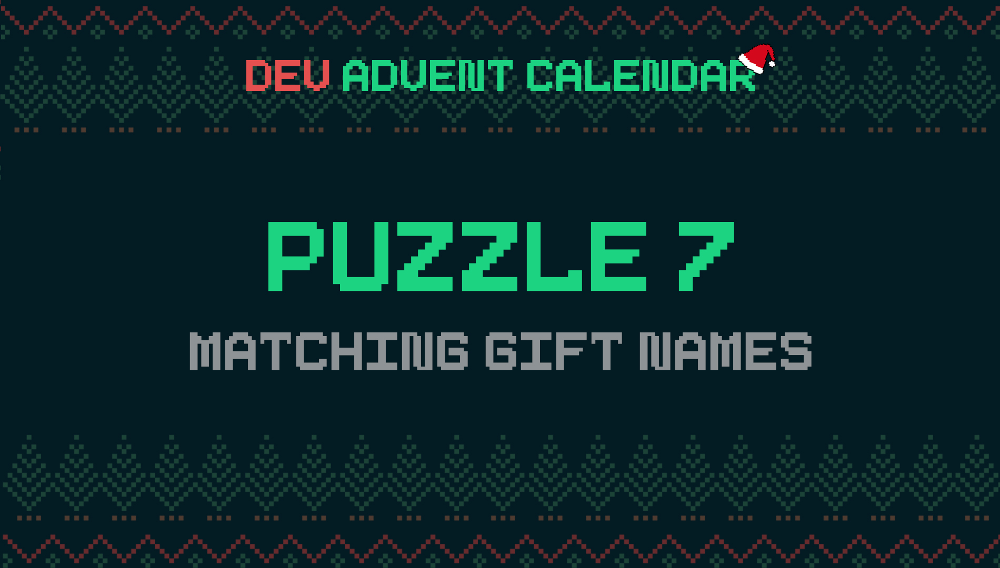

ℹ️ For detailed information about the contest, check out [devadvent/readme](https://github.com/devadvent/readme/)

# Dev Advent Calendar 🎅 Puzzle 7 - Matching Gift Names 🎁

There was a minor accident in the EPS (Elf Postal Service). The door of a delivery truck was not closed correctly, and some gifts fell in the snow.

This caused some name tags to be smudged in a way that some of the letters are not recognized anymore.

It is your task to recuperate the original names from the gift tags.

## 🧩 The puzzle

The affected gifts are in the [src/data/gifts.js](src/data/gifts.js) file - an array of objects. The name of the gift is the `giftName` property, and the gift recipient's name in the `for` property. The letters in the name that are smudged, are marked with a `#`. You can assume one `#` = 1 letter, and that no letters are missing.

Complete the function `matchedNames` that returns an array of possible names that match the smudged name (counter-checking with [names.js](src/data/names.js)).
Examples: `Anthon#` = `['Anthony']`, `Helen#` = `['Helena', 'Helene']`

💡 Hint: [Regular expressions](https://developer.mozilla.org/en-US/docs/Web/JavaScript/Guide/Regular_Expressions)

### Rules:

-   The answer always needs to be an array
-   The smudges can appear in any place of the name
-   One smudge `#` represents one letter
-   If no results are found, an empty array should be returned

## 🚢 Ship your solution

Check out the [contributing guide](https://github.com/devadvent/readme/blob/main/CONTRIBUTING.md) for details about how to participate.

In short:

-   ✨ Create your repository by [acceping the assignment](https://classroom.github.com/a/N3LXDVoW) using the participation link
-   🧩 Solve the puzzle
-   🐦 Add your Twitter handle to `twitter.js`
-   🤖 Test your solution
-   🚀 Upload your changes to the `main` branch

## 🔗 Participation link

In order to participate, you need to enter the following link and accept the assignment:
[https://classroom.github.com/a/N3LXDVoW](https://classroom.github.com/a/N3LXDVoW)

## 💻 Use this project

### ⏳ Install the dependencies

Install the dependencies with

```bash
yarn install
```

or

```bash
npm install
```

### ⚙️ Run the code

Run the code with

```bash
yarn dev
```

or

```bash
npm run dev
```

### 🤖 Test your solution

This puzzle is equipped with automated tests (in the `./tests` folder). In order for your solution to qualify for winning the daily prize, **all** tests need to pass.

To run these tests, execute one of the following commands in your console:

```bash
yarn test
```

or

```bash
npm test
```
