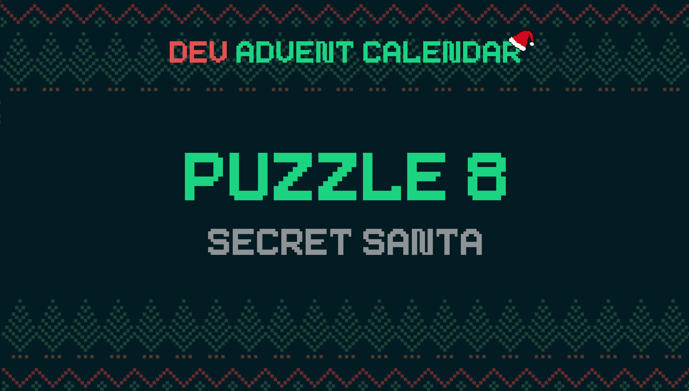

ℹ️ For detailed information about the contest, check out [devadvent/readme](https://github.com/devadvent/readme/)

# Dev Advent Calendar 🎅 Puzzle 8 - Secret Santa 🤫

The elves are organizing a pre-Christmas party, and they want to organize a "secret santa".

It is your job to write an algorithm that selects a secret santa for each participant.

_The concept of "secret santa" is the following: Each participant is assigned a so-called "secret santa", a person that will have to get a thoughtful gift for that person.
Usually this is in-person: All names are thrown in a hat, and each participant draws one. The paper you draw it the person you have to give a gift to. _

## 🧩 The puzzle

Find the names of the elves in [src/data/elves.js](src/data/elves.js).

Complete the function `assignNames` in the file [src/utils/secret.js](src/utils/secret.js) so that it returns an array of objects with name and secretSanta. The passed parameter `names` is an array of names (as `String`)

Example:

```javascript
;[
    { name: 'Jimmy', secretSanta: 'Johnny' },
    { name: 'Johnny', secretSanta: 'Sandra' },
    { name: 'Sandra', secretSanta: 'Jimmy' },
]
```

### Rules

-   There should be a secret santa for everyone
-   The secret santa should not be the same as the name
-   When there are duplicate names, throw a `Error('DUPLICATE_NAMES')`

## 🚢 Ship your solution

Check out the [contributing guide](https://github.com/devadvent/readme/blob/main/CONTRIBUTING.md) for details about how to participate.

In short:

-   ✨ Create your repository by [acceping the assignment](https://classroom.github.com/a/U0LIVMcE) using the participation link
-   🧩 Solve the puzzle
-   🐦 Add your Twitter handle to `twitter.js`
-   🤖 Test your solution
-   🚀 Upload your changes to the `main` branch

## 🔗 Participation link

In order to participate, you need to enter the following link and accept the assignment:
[https://classroom.github.com/a/U0LIVMcE](https://classroom.github.com/a/U0LIVMcE)

## 💻 Use this project

### ⏳ Install the dependencies

Install the dependencies with

```bash
yarn install
```

or

```bash
npm install
```

### ⚙️ Run the code

Run the code with

```bash
yarn dev
```

or

```bash
npm run dev
```

### 🤖 Test your solution

This puzzle is equipped with automated tests (in the `./tests` folder). In order for your solution to qualify for winning the daily prize, **all** tests need to pass.

To run these tests, execute one of the following commands in your console:

```bash
yarn test
```

or

```bash
npm test
```
